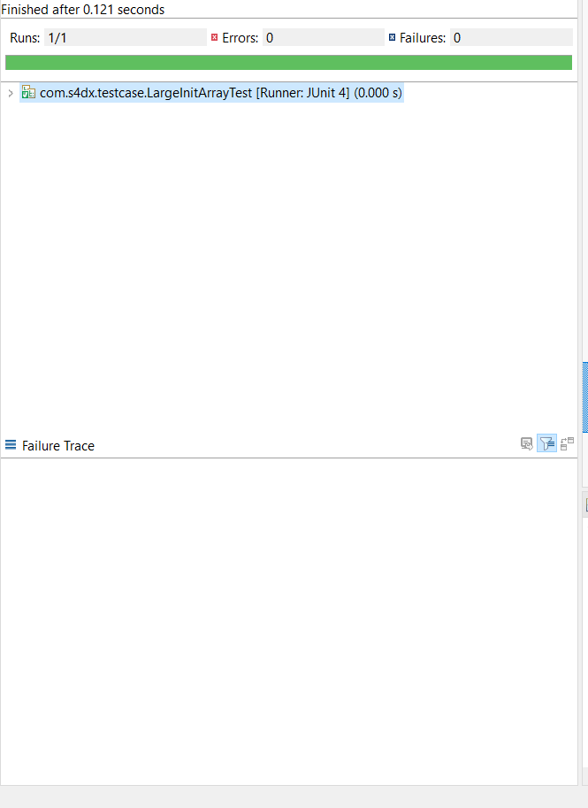

# Explanation of Project

I wrote a Java class that accepts an array of strings in the constructor. The class is exposing a `find` function that accepts a string. This function is returning all strings from the array that contains
the exact same characters as the string passed into it. The order of the characters in the strings is
not relevant.

---

# Launch

* Open the project on your file system in your IDE.
* Please make sure <b>Referenced Libraries </b> has jUnit and hamcrest jar's in. If not please apply the following instructions.

1. Open <b>Project -> Properties -> Java Build Path -> Libraries </b> 
2. Choose <b>Classpath</b> and click on Add JAR's button. 
3. Go to <b>lib</b> folder under our project and choose both jar files.
4. Make sure jar files are visible under <b>Classpath</b> section.
5. Apply and close.
6. Please check <b>Referenced Libraries </b> and make sure jar files are visible in there. If jar files are visible then you are ready for next steps if not please try above steps again.

* We have **logic** and **testcase** packages under our src directory. You can check **Finder** class under **logic** package to see our logic. 

* We have 3 test cases under **testcase** package;

1. **TestLogic.java:** This class is for testing logic. In our logic array of **{"asd", "asdd", "fre", "glk", "lkm"}** and target string of **"dsad"** will return **{null, "asdd", null, null, null}** because only "asdd" string contains characters of **'s', 'a' and 2 chars of 'd'** .

2. **MultipleRunTest.java:** This class is for running our logic for 50.000 times to see efficiency of our code. In our logic array of **{"asd", "asdd", "fre", "glk", "lkm"}** and target string of **"sad"** will return **{"asd", "asdd", null, null, null}** because both "asd" and "asdd" strings contains characters of **'s', 'a' and 'd'**.

3. **LargeInitArrayTest.java:** This class is for testing our logic to see how efficient it is with large arrays. Therefore I did initialized an array with 1 million elements and put correct string to last element of our array.

* To run this tests, please right click on the **class -> Run As -> Junit Test**.

---
# Test Results

* Our logic passed all three tests successfully.

* **MultipleRunTest** took **2.084 seconds** to finish.

* 

* **LargeInitArrayTest** took **0.121 seconds** to finish.

* 